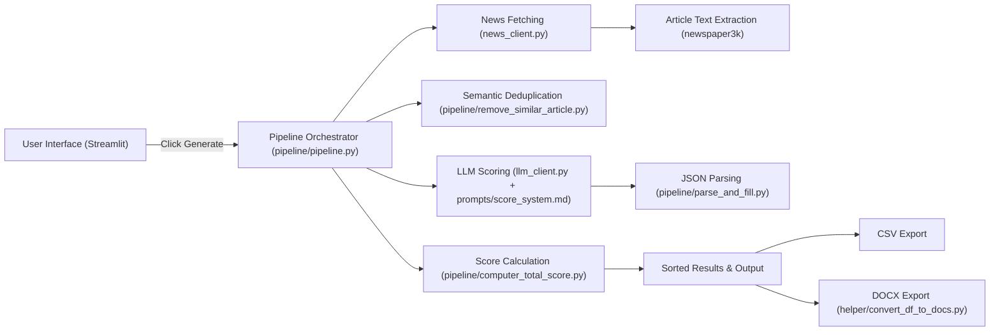

# FMCG Deal Intelligence Demo

## Overview

This repository is a Streamlit application that fetches FMCG and consumer goods news, analyzes each article using an LLM, computes deal relevance scores, removes duplicate articles, and exposes the results for download as CSV and DOCX.

## Architecture

### Architecture Diagram



### 1. User Interface
- `app.py`
  - Entry point for the Streamlit app.
  - Loads environment variables from `.env`.
  - Displays a button to generate the newsletter.
  - Shows the resulting dataframe and download buttons for CSV and DOCX.

### 2. News Data Collection
- `news_client.py`
  - Creates a `NewsApiClient` using `NEWS_API_KEY`.
  - Fetches article metadata from the NewsAPI.
  - Downloads full article text using `newspaper3k`.

### 3. Data Pipeline
- `pipeline/pipeline.py`
  - Orchestrates the processing workflow.
  - Steps:
    1. Query the News API for FMCG deal-related articles.
    2. Remove duplicate or highly similar items.
    3. Fetch full article text.
    4. Use the LLM to score and parse each article.
    5. Compute a combined `total_score`.
    6. Filter and sort the top news.

### 4. Semantic Deduplication
- `pipeline/remove_similar_article.py`
  - Uses `sentence-transformers` (`all-MiniLM-L6-v2`) to embed article descriptions.
  - Computes cosine similarity and removes near-duplicate articles.

### 5. LLM Scoring and Parsing
- `llm_client.py`
  - Connects to Google Gemini via `google-genai` using `LLM_API_KEY`.
  - Loads the prompt template from `prompts/score_system.md`.
  - Sends article text to the model and returns the generated JSON output.

- `pipeline/anaylise_article.py`
  - Sends article content to the LLM scoring pipeline.
  - Parses the LLM JSON response.

- `pipeline/parse_and_fill.py`
  - Converts the LLM response from text to JSON.
  - Ensures required keys exist and fills defaults when necessary.

### 6. Scoring Logic
- `pipeline/computer_total_score.py`
  - Calculates `total_score` using:
    - relevance score
    - confidence score
    - deal type importance
    - number of FMCG entities
  - Produces a normalized numeric score for ranking.

### 7. Document Export
- `helper/convert_df_to_docs.py`
  - Converts the final dataframe into a DOCX file for download.

## Key Files
- `app.py`: Streamlit UI and workflow trigger
- `llm_client.py`: LLM integration and prompt loading
- `news_client.py`: News API and article fetching
- `pipeline/pipeline.py`: Main orchestration of data flow
- `pipeline/remove_similar_article.py`: Duplicate article filtering
- `pipeline/anaylise_article.py`: LLM scoring wrapper
- `pipeline/parse_and_fill.py`: Response normalization
- `pipeline/computer_total_score.py`: Final score calculation
- `helper/convert_df_to_docs.py`: DOCX export
- `prompts/score_system.md`: LLM prompt definition

## Environment Variables

Create a `.env` file with:

```env
NEWS_API_KEY=your_news_api_key
LLM_API_KEY=your_gemini_api_key
```

## Installation

```bash
pip install -r requirements.txt
```

## Run

```bash
streamlit run app.py
```
